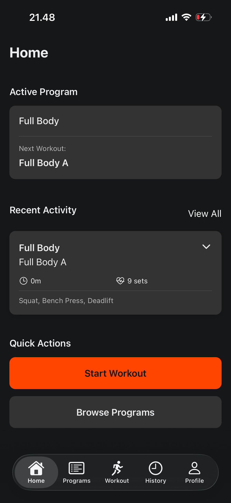
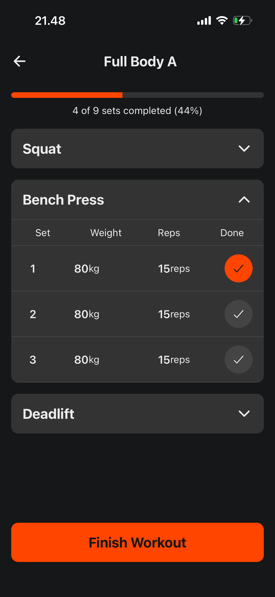
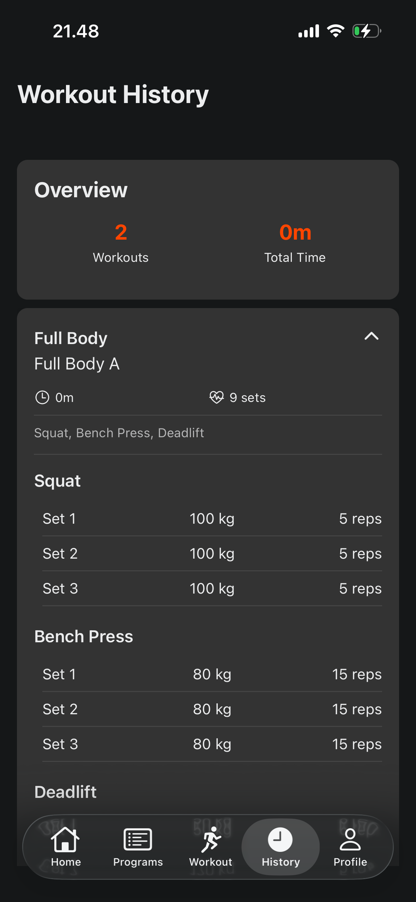

# Workout Tracker

A cross-platform mobile weightlifting tracking app built with React Native and Expo. Track your weightlifting sessions, manage workout programs, and monitor your fitness progress.

## Screenshots

  
  
  

## Features

- **Program Management**: Create and organize custom workout programs with multiple workouts
- **Live Workout Tracking**: Track sets, reps, and weights in real-time during your workout sessions
- **Progress Monitoring**: Visual progress indicators show completion status during workouts
- **Workout History**: View detailed history of completed workouts with exercise breakdowns
- **Smart Persistence**: Active program selection and workout data automatically synced with backend

## Tech Stack

- **Frontend**: React Native + Expo (SDK 54)
- **Navigation**: Expo Router (file-based routing)
